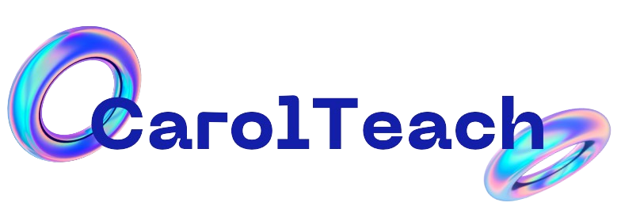

<h1 align="center">
    

</h1>

## 📖 Sobre

**Projeto Fictício - Sem Fins Comerciais** 

Este projeto é uma demonstração de habilidades em HTML, CSS, e JavaScript.

### ✨ Funcionalidades Principais

- **Responsividade:** O layout é adaptável para desktops, tablets e dispositivos móveis, garantindo uma experiência consistente em diferentes telas.
- **Organização do Código:** O código foi estruturado e documentado de forma clara e organizada, facilitando a compreensão e manutenção.
- **Animações CSS:** Utiliza animações CSS para tornar a experiência do usuário mais dinâmica e atraente.

### 💻 Como Acessar

Você pode acessar o WanderLust diretamente [aqui](https://technology-world.vercel.app/). 👀

## 🚀 Tecnologias Utilizadas

- HTML
- CSS
- JavaScript

---
Desenvolvido por [Carolina Lima](https://github.com/CarolinaLM)👩‍💻 - 2024
